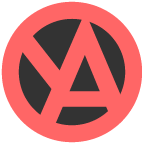

<body>
    

        <h1>
            Welcome to 
            <a href="https://github.com/LoveNek0">
                LoveNek0`s
            </a>
            profile ~
        </h1>
        

            
        

    

    

        <h2>
            About me
        </h2>
        
        

            I am a 23 y.o. girl from Ukraine who is a fan of anime, rock and programming. In my free time I do some freelance work or paint. I would be glad if you know more about me ♡~
        

        

            <ul>
                <li>
                    <b>
                        Nickname:
                    </b>
                    LoveNek0
                </li>
                <li>
                    <b>
                        Hobbies:
                    </b>
                    Painting, Anime, Manga, Coding
                </li>
                <li>
                    <b>
                        Languages
                    </b>
                    <ul>
                        <li>
                            <a href="https://en.wikipedia.org/wiki/Russian_language">
                                
                                Russian
                            </a>
                            - C2 (Proficiency) - Native
                        </li>
                        <li>
                            <a href="https://en.wikipedia.org/wiki/Ukrainian_language">
                                
                                Ukrainian
                            </a>
                            - C2 (Proficiency)
                        </li>
                        <li>
                            <a href="https://en.wikipedia.org/wiki/English_language">
                                
                                English
                            </a>
                            - B2 (Upper-Intermediate)
                        </li>
                    </ul>
                </li>
            </ul>
        

    

    

        <h2>
            My Skills
        </h2>
        <ul>
            <li>
                <b>
                    Fullstack Web:
                </b>
                PHP, JS, HTML, CSS
            </li>
            <li>
                <b>
                    Desktop/Console:
                </b>
                C, C++, C#, Java, jPHP
            </li>
            <li>
                <b>
                    IDEs I prefer to use:
                </b>
                Products of Intellij (like Idea, Rider, PHPStorm, WEBStorm etc.)
            </li>
        </ul>
    

    

        <h2>
            Statistics
        </h2>
        
        
    

    

        <h2>
            Contact me
        </h2>
        

            
            <!--
            
            
            
            
            
            -->
            
            
            <!--
            
            -->
        

    

</body>
